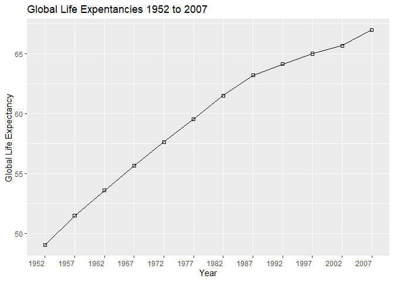
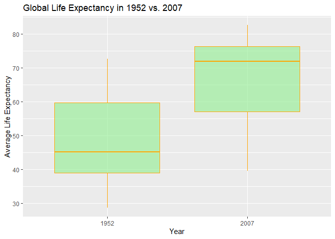
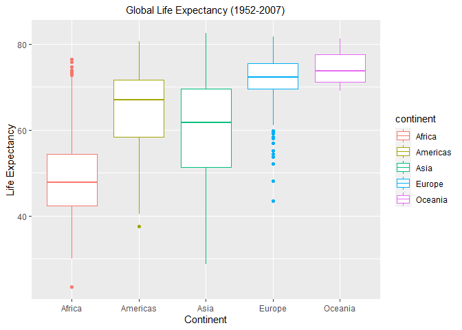
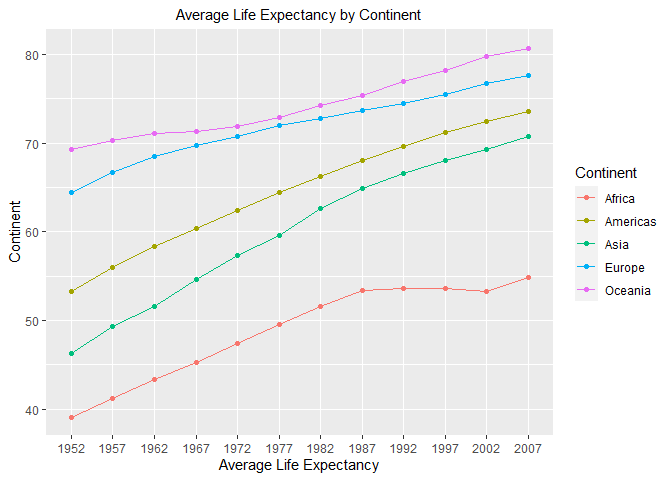
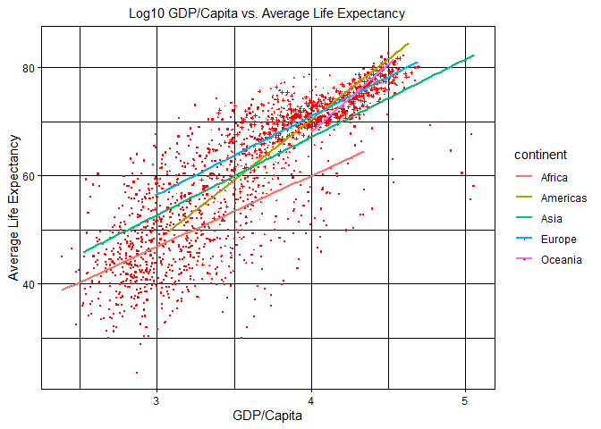
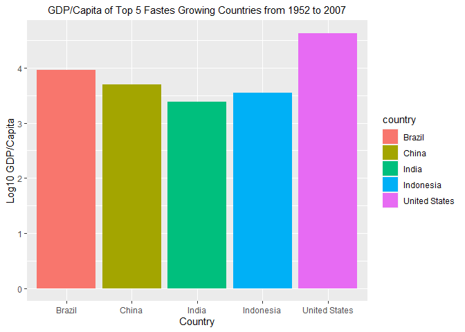

## Instructions
Answer the following questions and complete the exercises in RMarkdown. Please embed all of your code and push your final work to your repository. Your final lab report should be organized, clean, and run free from errors. Remember, you must remove the `#` for the included code chunks to run. Be sure to add your name to the author header above. For any included plots, make sure they are clearly labeled. You are free to use any plot type that you feel best communicates the results of your analysis.  

**In this homework, you should make use of the aesthetics you have learned. It's OK to be flashy!**

Make sure to use the formatting conventions of RMarkdown to make your report neat and clean!  

## Load the libraries

```r
library(tidyverse)
library(janitor)
library(here)
library(naniar)
```

## Resources
The idea for this assignment came from [Rebecca Barter's](http://www.rebeccabarter.com/blog/2017-11-17-ggplot2_tutorial/) ggplot tutorial so if you get stuck this is a good place to have a look.  

## Gapminder
For this assignment, we are going to use the dataset [gapminder](https://cran.r-project.org/web/packages/gapminder/index.html). Gapminder includes information about economics, population, and life expectancy from countries all over the world. You will need to install it before use. This is the same data that we will use for midterm 2 so this is good practice.

```r
##install.packages("gapminder")
library("gapminder")
```

## Questions
The questions below are open-ended and have many possible solutions. Your approach should, where appropriate, include numerical summaries and visuals. Be creative; assume you are building an analysis that you would ultimately present to an audience of stakeholders. Feel free to try out different `geoms` if they more clearly present your results.  

**1. Use the function(s) of your choice to get an idea of the overall structure of the data frame, including its dimensions, column names, variable classes, etc. As part of this, determine how NA's are treated in the data.** 

```r
gapminder_tidy <- janitor::clean_names(gapminder)
```

```r
glimpse(gapminder_tidy)
```

```
## Rows: 1,704
## Columns: 6
## $ country    <fct> Afghanistan, Afghanistan, Afghanistan, Afghanistan, Afghan…
## $ continent  <fct> Asia, Asia, Asia, Asia, Asia, Asia, Asia, Asia, Asia, Asia…
## $ year       <int> 1952, 1957, 1962, 1967, 1972, 1977, 1982, 1987, 1992, 1997…
## $ life_exp   <dbl> 28.801, 30.332, 31.997, 34.020, 36.088, 38.438, 39.854, 40…
## $ pop        <int> 8425333, 9240934, 10267083, 11537966, 13079460, 14880372, …
## $ gdp_percap <dbl> 779.4453, 820.8530, 853.1007, 836.1971, 739.9811, 786.1134…
```

```r
naniar::miss_var_summary(gapminder_tidy)
```

```
## # A tibble: 6 x 3
##   variable   n_miss pct_miss
##   <chr>       <int>    <dbl>
## 1 country         0        0
## 2 continent       0        0
## 3 year            0        0
## 4 life_exp        0        0
## 5 pop             0        0
## 6 gdp_percap      0        0
```

**2. Among the interesting variables in gapminder is life expectancy. How has global life expectancy changed between 1952 and 2007?**

```r
gapminder_tidy %>% 
  group_by(year) %>% 
  summarize(mean_life_exp=mean(life_exp)) %>% 
  arrange(year)
```

```
## `summarise()` ungrouping output (override with `.groups` argument)
```

```
## # A tibble: 12 x 2
##     year mean_life_exp
##    <int>         <dbl>
##  1  1952          49.1
##  2  1957          51.5
##  3  1962          53.6
##  4  1967          55.7
##  5  1972          57.6
##  6  1977          59.6
##  7  1982          61.5
##  8  1987          63.2
##  9  1992          64.2
## 10  1997          65.0
## 11  2002          65.7
## 12  2007          67.0
```

```r
gapminder_tidy$year <- as.factor(gapminder_tidy$year)
```


```r
gapminder_tidy %>% 
  group_by(year) %>% 
  summarize(mean_life_exp=mean(life_exp)) %>% 
  ggplot(aes(x=year, y=mean_life_exp))+
  geom_point(shape=0.75)+
  geom_line(aes(group=1))+
  theme(axis.text.x = element_text(hjust = 1))+
  geom_smooth(method="lm", se=FALSE, color="blue")+
  labs(title="Global Life Expentancies 1952 to 2007",
       x="Year", y="Global Life Expectancy")
```

```
## `summarise()` ungrouping output (override with `.groups` argument)
```

```
## `geom_smooth()` using formula 'y ~ x'
```

<!-- -->


**3. How do the distributions of life expectancy compare for the years 1952 and 2007?**

```r
gapminder_tidy %>% 
  filter(year=="1952" | year=="2007") %>% 
  group_by(year) %>%
 summarize(median_life_exp=median(life_exp),
       min_life_exp=min(life_exp),
       max_life_exp=max(life_exp))
```

```
## `summarise()` ungrouping output (override with `.groups` argument)
```

```
## # A tibble: 2 x 4
##   year  median_life_exp min_life_exp max_life_exp
##   <fct>           <dbl>        <dbl>        <dbl>
## 1 1952             45.1         28.8         72.7
## 2 2007             71.9         39.6         82.6
```


```r
gapminder_tidy %>% 
  filter(year=="1952" | year=="2007") %>% 
  group_by(year) %>%
  ggplot(aes(x=year, y=life_exp, group+year))+
  geom_boxplot(fill="lightgreen", color="orange", alpha=0.6)+
  labs(title="Global Life Expectancy in 1952 vs. 2007",
       x="Year",
       y="Average Life Expectancy")
```

<!-- -->

**4. Your answer above doesn't tell the whole story since life expectancy varies by region. Make a summary that shows the min, mean, and max life expectancy by continent for all years represented in the data.**

```r
gapminder_tidy %>% 
  group_by(continent, year) %>% 
  summarize(median_life_exp=median(life_exp),
       min_life_exp=min(life_exp),
       max_life_exp=max(life_exp)) 
```

```
## `summarise()` regrouping output by 'continent' (override with `.groups` argument)
```

```
## # A tibble: 60 x 5
## # Groups:   continent [5]
##    continent year  median_life_exp min_life_exp max_life_exp
##    <fct>     <fct>           <dbl>        <dbl>        <dbl>
##  1 Africa    1952             38.8         30           52.7
##  2 Africa    1957             40.6         31.6         58.1
##  3 Africa    1962             42.6         32.8         60.2
##  4 Africa    1967             44.7         34.1         61.6
##  5 Africa    1972             47.0         35.4         64.3
##  6 Africa    1977             49.3         36.8         67.1
##  7 Africa    1982             50.8         38.4         69.9
##  8 Africa    1987             51.6         39.9         71.9
##  9 Africa    1992             52.4         23.6         73.6
## 10 Africa    1997             52.8         36.1         74.8
## # … with 50 more rows
```


```r
gapminder_tidy %>% 
  group_by(continent, year) %>% 
  ggplot(aes(x=continent, y=life_exp, group=continent, color=continent))+
           geom_boxplot()+
   theme(plot.title = element_text(size = rel(1), hjust = 0.5))+theme(axis.text.x = element_text(hjust = 0.5))+
   labs(title="Global Life Expectancy (1952-2007)", x="Continent", y="Life Expectancy")
```

<!-- -->

**5. How has life expectancy changed between 1952-2007 for each continent?**

```r
gapminder_tidy %>% 
  group_by(continent, year) %>% 
  summarize(mean_life_exp=mean(life_exp))
```

```
## `summarise()` regrouping output by 'continent' (override with `.groups` argument)
```

```
## # A tibble: 60 x 3
## # Groups:   continent [5]
##    continent year  mean_life_exp
##    <fct>     <fct>         <dbl>
##  1 Africa    1952           39.1
##  2 Africa    1957           41.3
##  3 Africa    1962           43.3
##  4 Africa    1967           45.3
##  5 Africa    1972           47.5
##  6 Africa    1977           49.6
##  7 Africa    1982           51.6
##  8 Africa    1987           53.3
##  9 Africa    1992           53.6
## 10 Africa    1997           53.6
## # … with 50 more rows
```


```r
gapminder_tidy %>% 
  group_by(continent, year) %>% 
  summarize(mean_life_exp=mean(life_exp)) %>% 
  ggplot(aes(x=year, y=mean_life_exp, color=continent, group=continent))+
  geom_point()+
  geom_line()+
  theme(plot.title = element_text(size = rel(1), hjust = 0.5))+
  theme(axis.text.x = element_text(hjust = 0.5))+
  labs(title="Average Life Expectancy by Continent", x="Average Life Expectancy", y="Continent", color="Continent")
```

```
## `summarise()` regrouping output by 'continent' (override with `.groups` argument)
```

<!-- -->

**6. We are interested in the relationship between per capita GDP and life expectancy; i.e. does having more money help you live longer?**

```r
gapminder_tidy %>% 
  ggplot(aes(x=log10(gdp_percap), y=life_exp, color=continent, shape=continent))+
  geom_point(color="red", size=0.5)+
  theme_linedraw()+
  geom_smooth(method="lm", se=FALSE)+
  theme(plot.title = element_text(size = rel(1), hjust = 0.5))+
  theme(axis.text.x = element_text(hjust = 0.5))+
  labs(title="Log10 GDP/Capita vs. Average Life Expectancy", x="GDP/Capita", y="Average Life Expectancy")
```

```
## `geom_smooth()` using formula 'y ~ x'
```

<!-- -->

**7. Which countries have had the largest population growth since 1952?**

```r
gapminder_tidy_growth <- gapminder_tidy %>% 
  group_by(country) %>% 
  filter(year=="1952" | year=="2007") %>% 
  mutate(pop_growth=pop-lag(pop, default=first(pop))) %>% 
  arrange(desc(pop_growth))
gapminder_tidy_growth
```

```
## # A tibble: 284 x 7
## # Groups:   country [142]
##    country       continent year  life_exp        pop gdp_percap pop_growth
##    <fct>         <fct>     <fct>    <dbl>      <int>      <dbl>      <int>
##  1 China         Asia      2007      73.0 1318683096      4959.  762419569
##  2 India         Asia      2007      64.7 1110396331      2452.  738396331
##  3 United States Americas  2007      78.2  301139947     42952.  143586947
##  4 Indonesia     Asia      2007      70.6  223547000      3541.  141495000
##  5 Brazil        Americas  2007      72.4  190010647      9066.  133408087
##  6 Pakistan      Asia      2007      65.5  169270617      2606.  127924057
##  7 Bangladesh    Asia      2007      64.1  150448339      1391.  103561480
##  8 Nigeria       Africa    2007      46.9  135031164      2014.  101912068
##  9 Mexico        Americas  2007      76.2  108700891     11978.   78556574
## 10 Philippines   Asia      2007      71.7   91077287      3190.   68638596
## # … with 274 more rows
```
The three countries that have seen the most growth are China, India, and the Untied States. 
**8. Use your results from the question above to plot population growth for the top five countries since 1952.**

```r
gapminder_tidy_growth %>% 
  filter(pop_growth>=133408087) %>% 
  ggplot(aes(x=country, y=log10(pop_growth), fill=country))+
  geom_col()+
  theme(plot.title = element_text(size = rel(1), hjust = 0.5))+
  theme(axis.text.x = element_text(hjust = 0.5))+
  labs(title="Top 5 Fastes Growing Countries from 1952 to 2007", x="Country", y="Log10 Population Growth")
```

<!-- -->

**9. How does per-capita GDP growth compare between these same five countries?**

```r
gapminder_tidy_growth %>% 
  filter(pop_growth>=133408087) %>% 
  ggplot(aes(x=country, y=log10(gdp_percap), fill=country))+
  geom_col()+
  theme(plot.title = element_text(size = rel(1), hjust = 0.5))+
  theme(axis.text.x = element_text(hjust = 0.5))+
  labs(title="GDP/Capita of Top 5 Fastes Growing Countries from 1952 to 2007", x="Country", y="Log10 GDP/Capita")
```

<!-- -->

**10. Make one plot of your choice that uses faceting!**

```r
gapminder_tidy_growth %>% 
  ggplot(aes(x=log10(gdp_percap)))+
          geom_density()+
          facet_wrap(~continent)
```

<!-- -->

## Push your final code to GitHub!
Please be sure that you check the `keep md` file in the knit preferences. 
